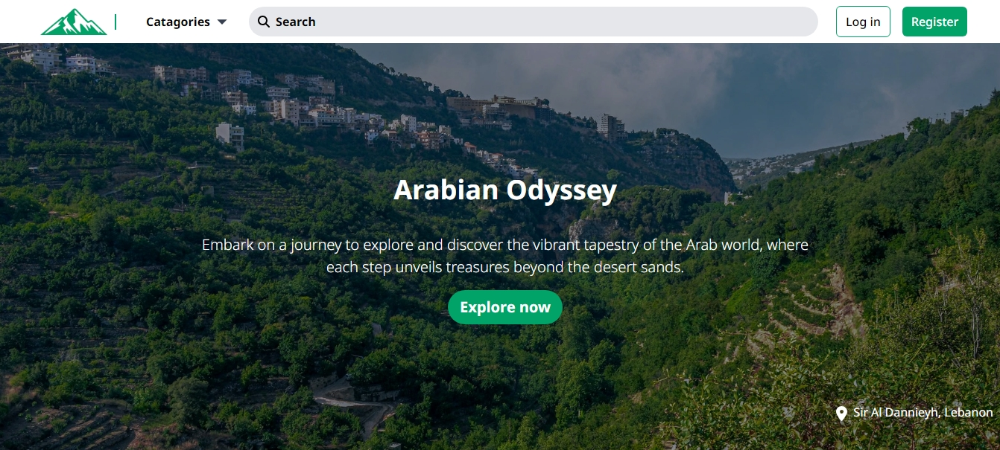

  
  
Arabian Odyssey

# Arabian Odyssey

A web app for viewing and learning a bout a Arab world Tourist attractions. It was created at the Arab American Society For Education And Development Hackathon for building an app to benefit the Arab world.

## Team

#### [Salah Samir](https://github.com/salahsamir)

Developed the [Backend API](https://github.com/salahsamir/Arabian-Odyssey)

#### [Houssem Degachi](https://github.com/HoussemDegachi)

Designed and Developed the front-end interface

#### [Abdalrhman Almarakeby](https://github.com/Abdalrhman-Almarakeby)

Developed the front-end interface
